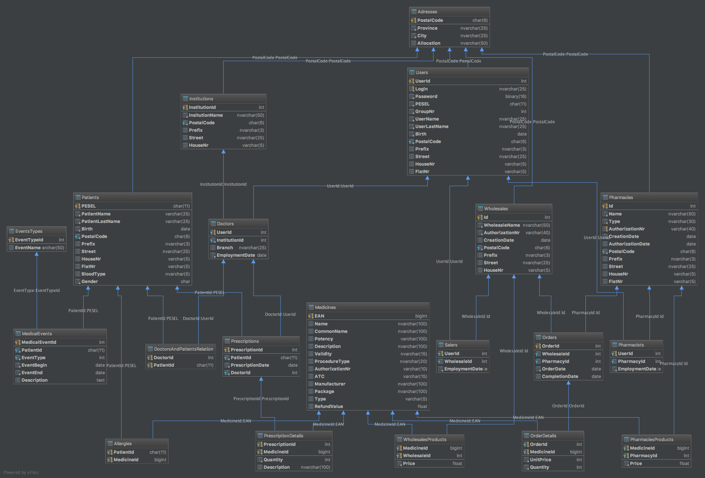

# Medical Prescriptions System

Główną ideą stojącą za **Medical Prescriptions System** było zaprojektowanie i zaimplementowanie systemu służącego do usprawnienia pracy placówek leczniczych i całego procesu leczenia od diagnozy przez wystawienie recepty po uzyskanie leków w możliwie najkrótszym czasie i najniższej cenie. W projekcie można wyróżnić trzy główne składowe. Pierwszą z nich jest obsługa zamówień w hurtownii i kontrola stanu i cen produktów. Podobna funkcjonalność została przygotowana do obsługi aptek i punktów aptecznych. Głównym elementem pozostaje mechanizm obsługi pacjentów, prowadzenia placówek leczniczych, koordynacja lekarzami i wystawianie recept leków.

W trakcie tworzenia bazy korzystaliśmy z ogólnodostępnych **rzeczywistych** danych pobranych z portalu: https://danepubliczne.gov.pl
Na dane te składają się:
- Lista leków
- Kwoty refundacji leków za rok 2016
- Lista hurtownii produktów medycznych
- Lista placówek leczniczych

Większość danych została przefiltrowana w celu usunięcia wpisów z niepełnymi danymi i ograniczona głównie do miasta Kraków.

## Autorzy
* Łukasz Kowalski ([@luke9642](https://github.com/luke9642))
* Rafał Jankowski ([@raalsky](https://github.com/raalsky))

# Diagram


# Podsumowanie
|Byt|Liczba elementów|
|:----------:|:-------------:|
|Tabele|20|
|Zdefiniowane typy tablicowe|2|
|Widoki|5|
|Procedury|15|
|Funkcje|6|
|Wyzwalacze|9|
|Indeksy|6|

# Kod SQL
## Tabele (20)
### Tabela Adresses
```sql
CREATE TABLE Adresses
(
    PostalCode CHAR(6) PRIMARY KEY NOT NULL,
    Province NVARCHAR(25) NOT NULL,
    City NVARCHAR(25) NOT NULL,
    Allocation NVARCHAR(50)
);
```
### Tabela Allergies
```sql
CREATE TABLE Allergies
(
    PatientId CHAR(11) NOT NULL,
    MedicineId BIGINT NOT NULL,
    CONSTRAINT PK__Allergie__83FCD1EF2CEB343A PRIMARY KEY (PatientId, MedicineId),
    CONSTRAINT FK__Allergies__Patie__7A3223E8 FOREIGN KEY (PatientId) REFERENCES Patients (PESEL),
    CONSTRAINT FK__Allergies__Medic__7B264821 FOREIGN KEY (MedicineId) REFERENCES Medicines (EAN)
);
```
### Tabela Doctors
```sql
CREATE TABLE Doctors
(
    UserId INT PRIMARY KEY NOT NULL,
    InstitutionId INT NOT NULL,
    Branch NVARCHAR(25),
    EmploymentDate DATE NOT NULL,
    CONSTRAINT FK__Doctors__UserId__5CA1C101 FOREIGN KEY (UserId) REFERENCES Users (UserId),
    CONSTRAINT FK__Doctors__Institu__7755B73D FOREIGN KEY (InstitutionId) REFERENCES Institutions (InstitutionId)
);
```
### Tabela DoctorsAndPatrientsRelation
```sql
CREATE TABLE DoctorsAndPatientsRelation
(
    DoctorId INT NOT NULL,
    PatientId CHAR(11) NOT NULL,
    CONSTRAINT DoctorsAndPatientsRelation_PatientId_DoctorId_pk PRIMARY KEY (DoctorId, PatientId),
    CONSTRAINT FK__DoctorsAn__Docto__6CD828CA FOREIGN KEY (DoctorId) REFERENCES Doctors (UserId),
    CONSTRAINT FK__DoctorsAn__Patie__756D6ECB FOREIGN KEY (PatientId) REFERENCES Patients (PESEL)
);
```
### Tabela EventsTypes
```sql
CREATE TABLE EventsTypes
(
    EventTypeId INT PRIMARY KEY NOT NULL,
    EventName NVARCHAR(50)
);
```
### Tabela Institutions
```sql
CREATE TABLE Institutions
(
    InstitutionId INT PRIMARY KEY NOT NULL IDENTITY,
    InstitutionName NVARCHAR(50) NOT NULL,
    PostalCode CHAR(6) NOT NULL,
    Prefix NVARCHAR(3),
    Street NVARCHAR(25),
    HouseNr VARCHAR(5),
    CONSTRAINT Institutions_Adresses_PostalCode_fk FOREIGN KEY (PostalCode) REFERENCES Adresses (PostalCode)
);
```
### Tabela MedicalEvents
```sql
CREATE TABLE MedicalEvents
(
    MedicalEventId INT PRIMARY KEY NOT NULL IDENTITY,
    PatientId CHAR(11) NOT NULL,
    EventType INT NOT NULL,
    EventBegin DATE NOT NULL,
    EventEnd DATE NOT NULL,
    Description TEXT,
    CONSTRAINT FK__MedicalHi__Patie__3C69FB99 FOREIGN KEY (PatientId) REFERENCES Patients (PESEL),
    CONSTRAINT FK__MedicalHi__Event__3D5E1FD2 FOREIGN KEY (EventType) REFERENCES EventsTypes (EventTypeId)
);
```
### Tabela Medicines
```sql
CREATE TABLE Medicines
(
    EAN BIGINT PRIMARY KEY NOT NULL,
    Name NVARCHAR(100),
    CommonName NVARCHAR(100),
    Potency VARCHAR(100),
    Description NVARCHAR(100),
    Validity NVARCHAR(15),
    ProcedureType NVARCHAR(20),
    AuthorizationNr VARCHAR(10),
    ATC VARCHAR(15),
    Manufacturer NVARCHAR(100),
    Package NVARCHAR(100),
    Type VARCHAR(5),
    RefundValue FLOAT
);
CREATE UNIQUE INDEX Medicines_EAN_uindex ON Medicines (EAN);
```
### Tabela OrderDetails
```sql
CREATE TABLE OrderDetails
(
    OrderId INT NOT NULL,
    MedicineId BIGINT NOT NULL,
    UnitPrice INT NOT NULL,
    Quantity INT NOT NULL,
    CONSTRAINT PK__OrderDet__D7624946D19FFED2 PRIMARY KEY (OrderId, MedicineId),
    CONSTRAINT FK__OrderDeta__Order__45BE5BA9 FOREIGN KEY (OrderId) REFERENCES Orders (OrderId),
    CONSTRAINT OrderDetails_Medicines_EAN_fk FOREIGN KEY (MedicineId) REFERENCES Medicines (EAN)
);
```
### Tabela Orders
```sql
CREATE TABLE Orders
(
    OrderId INT PRIMARY KEY NOT NULL IDENTITY,
    WholesaleId INT,
    PharmacyId INT,
    OrderDate DATE NOT NULL,
    CompletionDate DATE DEFAULT NULL,
    CONSTRAINT Orders_Wholesales_Id_fk FOREIGN KEY (WholesaleId) REFERENCES Wholesales (Id),
    CONSTRAINT Orders_Pharmacies_Id_fk FOREIGN KEY (PharmacyId) REFERENCES Pharmacies (Id)
);
```
### Tabela Patients
```sql
CREATE TABLE Patients
(
    PESEL CHAR(11) PRIMARY KEY NOT NULL,
    PatientName VARCHAR(25) NOT NULL,
    PatientLastName VARCHAR(25) NOT NULL,
    Birth DATE NOT NULL,
    PostalCode CHAR(6) NOT NULL,
    Prefix NVARCHAR(3),
    Street NVARCHAR(25),
    HouseNr VARCHAR(5),
    FlatNr VARCHAR(5),
    BloodType NVARCHAR(5),
    Gender CHAR NOT NULL,
    CONSTRAINT Patients_Adresses_PostalCode_fk FOREIGN KEY (PostalCode) REFERENCES Adresses (PostalCode)
);
```
### Tabela Pharmacies
```sql
CREATE TABLE Pharmacies
(
    Id INT PRIMARY KEY NOT NULL IDENTITY,
    Name NVARCHAR(50) NOT NULL,
    Type NVARCHAR(30) NOT NULL,
    AuthorizationNr VARCHAR(40) NOT NULL,
    CreationDate DATE NOT NULL,
    AuthorizationDate DATE,
    PostalCode CHAR(6) NOT NULL,
    Prefix NVARCHAR(3),
    Street NVARCHAR(25),
    HouseNr VARCHAR(5),
    FlatNr VARCHAR(5),
    CONSTRAINT Pharmacies_Adresses_PostalCode_fk FOREIGN KEY (PostalCode) REFERENCES Adresses (PostalCode)
);
CREATE UNIQUE INDEX Pharmacies_Id_uindex ON Pharmacies (Id);
CREATE UNIQUE INDEX Pharmacies_AuthorizationNr_uindex ON Pharmacies (AuthorizationNr);
```
### Tabela PharmaciesProducts
```sql
CREATE TABLE PharmaciesProducts
(
    MedicineId BIGINT NOT NULL,
    PharmacyId INT NOT NULL,
    Price FLOAT NOT NULL,
    CONSTRAINT PK__Pharmaci__B4F8FA3A90C10BBB PRIMARY KEY (MedicineId, PharmacyId),
    CONSTRAINT PharmaciesProducts_Medicines_EAN_fk FOREIGN KEY (MedicineId) REFERENCES Medicines (EAN),
    CONSTRAINT PharmaciesProducts_Pharmacies_Id_fk FOREIGN KEY (PharmacyId) REFERENCES Pharmacies (Id)
);
```
### Tabela Pharmacists
```sql
CREATE TABLE Pharmacists
(
    UserId INT PRIMARY KEY NOT NULL,
    PharmacyId INT,
    EmploymentDate DATE NOT NULL,
    CONSTRAINT FK__Pharmacis__UserI__671F4F74 FOREIGN KEY (UserId) REFERENCES Users (UserId),
    CONSTRAINT Pharmacists_Pharmacies_Id_fk FOREIGN KEY (PharmacyId) REFERENCES Pharmacies (Id)
);
```
### Tabela PrescriptionDetails
```sql
CREATE TABLE PrescriptionDetails
(
    PrescriptionId INT NOT NULL,
    MedicineId BIGINT NOT NULL,
    Quantity INT DEFAULT 1 NOT NULL,
    Description NVARCHAR(100),
    CONSTRAINT PK__Prescrip__54E11ABBCAED791D PRIMARY KEY (PrescriptionId, MedicineId),
    CONSTRAINT FK__Prescript__Presc__4D5F7D71 FOREIGN KEY (PrescriptionId) REFERENCES Prescriptions (PrescriptionId),
    CONSTRAINT PrescriptionDetails_Medicines_EAN_fk FOREIGN KEY (MedicineId) REFERENCES Medicines (EAN)
);
```
### Tabela Prescriptions
```sql
CREATE TABLE Prescriptions
(
    PrescriptionId INT PRIMARY KEY NOT NULL IDENTITY,
    PatientId CHAR(11) NOT NULL,
    PrescriptionDate DATE NOT NULL,
    DoctorId INT NOT NULL,
    CONSTRAINT FK__Prescript__Patie__4316F928 FOREIGN KEY (PatientId) REFERENCES Patients (PESEL),
    CONSTRAINT FK__Prescript__Docto__619B8048 FOREIGN KEY (DoctorId) REFERENCES Doctors (UserId)
);
```
### Tabela Salers
```sql
CREATE TABLE Salers
(
    UserId INT PRIMARY KEY NOT NULL,
    WholesaleId INT,
    EmploymentDate DATE NOT NULL,
    CONSTRAINT FK__Salers__UserId__634EBE90 FOREIGN KEY (UserId) REFERENCES Users (UserId),
    CONSTRAINT Salers_Wholesales_Id_fk FOREIGN KEY (WholesaleId) REFERENCES Wholesales (Id)
);
```
### Tabela Users
```sql
CREATE TABLE Users
(
    UserId INT PRIMARY KEY NOT NULL IDENTITY,
    Login NVARCHAR(25) NOT NULL,
    Password BINARY(16) NOT NULL,
    PESEL CHAR(11) NOT NULL,
    GroupNr INT NOT NULL,
    UserName NVARCHAR(25) NOT NULL,
    UserLastName NVARCHAR(25) NOT NULL,
    Birth DATE NOT NULL,
    PostalCode CHAR(6) NOT NULL,
    Prefix NVARCHAR(3),
    Street NVARCHAR(25),
    HouseNr VARCHAR(5),
    FlatNr VARCHAR(5),
    CONSTRAINT Users_Adresses_PostalCode_fk FOREIGN KEY (PostalCode) REFERENCES Adresses (PostalCode)
);
CREATE UNIQUE INDEX UQ__Users__5E55825B1C8A0ED9 ON Users (Login);
```
### Tabela Wholesales
```sql
CREATE TABLE Wholesales
(
    Id INT PRIMARY KEY NOT NULL IDENTITY,
    WholesaleName NVARCHAR(50) NOT NULL,
    AuthorizationNr VARCHAR(40) NOT NULL,
    CreationDate DATE,
    PostalCode CHAR(6) NOT NULL,
    Prefix NVARCHAR(3),
    Street NVARCHAR(25),
    HouseNr VARCHAR(5),
    CONSTRAINT Wholesales_Adresses_PostalCode_fk FOREIGN KEY (PostalCode) REFERENCES Adresses (PostalCode)
);
CREATE UNIQUE INDEX Wholesales_Id_uindex ON Wholesales (Id);
```
### Tabela WholesalesProducts
```sql
CREATE TABLE WholesalesProducts
(
    MedicineId BIGINT NOT NULL,
    WholesaleId INT NOT NULL,
    Price FLOAT NOT NULL,
    CONSTRAINT PK__Wholesal__D372E6CEC58D94DE PRIMARY KEY (MedicineId, WholesaleId),
    CONSTRAINT WholesalesProducts_Medicines_EAN_fk FOREIGN KEY (MedicineId) REFERENCES Medicines (EAN),
    CONSTRAINT WholesalesProducts_Wholesales_Id_fk FOREIGN KEY (WholesaleId) REFERENCES Wholesales (Id)
);
```
## Dodatkowe przykładowe zdefiniowane wymagania tabel
```sql
ALTER TABLE Users
ADD CHECK (Birth BETWEEN '1900-01-01' AND GETDATE())

ALTER TABLE Patients
ADD CHECK (Gender IN ('M','K'))

ALTER TABLE Users
ADD CHECK (dbo.isAlphaNumerical(HouseNr) != 0)
```
## Widoki (5)
### Widok UsersWithMoreThanOneRole
Widok ten podaje PESEL, imię i nazwisko osób, które mogą być jednocześnie na przykład i lekarzami i farmaceutami.
```sql
CREATE VIEW UsersWithMoreThanOneRole
AS
SELECT DISTINCT U.PESEL, UserName, UserLastName FROM Users U JOIN
  (SELECT PESEL FROM Users
GROUP BY PESEL
HAVING COUNT(*) > 1) AS P
  ON U.PESEL = P.PESEL
```
### Widok PatientsRetired
Wyświetla wszystkie dane o pacjentach na emeryturze. Przyjęliśmy założenie, że kobiety przechodzą na emeryturę po 60 roku życia, a mężczyźni po 65. Również uprościliśmy to zagadnienie do wieku pacjentów (w naszym projekcie zakładamy, że osoba przekraczająca dany wiek przechodzi od razu na emeryturę, co w rzeczywistości nie zawsze ma miejsce).
```sql
CREATE VIEW PatientsRetired AS
SELECT * FROM Patients
WHERE (Gender = 'M' AND
(DATEPART(YY, GETDATE()) - DATEPART(YY,Birth) > 65
OR (DATEPART(YY, GETDATE()) - DATEPART(YY, Birth) = 65 AND DATEPART(MM, GETDATE()) - DATEPART(MM, Birth) > 0)
OR (DATEPART(YY, GETDATE()) - DATEPART(YY, Birth) = 65 AND DATEPART(MM, GETDATE()) - DATEPART(MM, Birth) = 0 AND DATEPART(DD, GETDATE()) - DATEPART(DD, Birth) > 0)))
OR (Gender = 'K' AND
(DATEPART(YY, GETDATE()) - DATEPART(YY,Birth) > 60
OR (DATEPART(YY, GETDATE()) - DATEPART(YY, Birth) = 60 AND DATEPART(MM, GETDATE()) - DATEPART(MM, Birth) > 0)
OR (DATEPART(YY, GETDATE()) - DATEPART(YY, Birth) = 60 AND DATEPART(MM, GETDATE()) - DATEPART(MM, Birth) = 0 AND DATEPART(DD, GETDATE()) - DATEPART(DD, Birth) > 0)))
```
### Widok MedicinesRefundsMoreThanHalf
Wyświetla dane dotyczące leków, których procent refundacji jest większy bądź równy od 50%.  Wyliczany na podstawie funkcji __RefundPercent__ (opis funkcji podany niżej). Cena sprawdzana na podstawie kolumny Price z tabeli __PharmaciesProducts__.
```sql
CREATE VIEW MedicinesRefundsMoreThanHalf
AS
  SELECT dbo.RefundPercent(MedicineId, Price) Refund, Medicines.Name MedicineName, CommonName, PharmacyId, Pharmacies.Name PharmacyName, Price  FROM PharmaciesProducts
    JOIN Medicines
    ON PharmaciesProducts.MedicineId = Medicines.EAN
    JOIN Pharmacies
    ON Pharmacies.Id = PharmaciesProducts.PharmacyId
  WHERE dbo.RefundPercent(MedicineId, Price) >= 50
```
### Widok PharmaciesAmountGroupedByCity
Podaje liczbę aptek w każdej miejscowości.
```sql
CREATE VIEW PharmaciesAmountGroupedByCity
AS
SELECT City, COUNT(*) AmountOfPharmacies
FROM Pharmacies P JOIN Adresses A
ON P.PostalCode = A.PostalCode
GROUP BY City
```
### Widok NumberOfMedicinesInPharmacies
Podaje identyfikatory i liczbę leków w każdej aptece.
```sql
CREATE VIEW NumberOfMedicinesInPharmacies
AS
SELECT Pharmacies.Id, (SELECT COUNT(*) FROM PharmaciesProducts WHERE PharmaciesProducts.PharmacyId = Pharmacies.Id) NumberOfMedicines FROM Pharmacies
```
## Typy tablicowe (2)
### Typ PrescriptionMedicines
Typ przyjmowany przy operacji AddPrescription. Zawiera opis recepty w postaci identyfikatora leku, ilości produktów i opisu dawkowania.
```sql
CREATE TYPE PrescriptionMedicines AS TABLE
(
  EAN BIGINT,
  Quantity INT,
  Description TEXT
)
```
### Typ ConflictedMedicines
Typ zwracany przy operacji CheckAllergy. Przechowuje listę leków na które jest uczulony dany pacjent.
```sql
CREATE TYPE ConflictedMedicines AS TABLE ( EAN BIGINT );
```
## Procedury (15)
### Procedura __AddUser
Jedna z najbardziej rozbudowanych procedur. Przedrostek nazwy procedury ma na celu wskazanie, że jest to procedura wykorzystywana wewnętrznie przez inne procedury. Nie powinna zostać uruchamiana bezpośrednio jako zdania SQL. Wstawia podane dane użytkowników do tabeli Users. Sprawdza poprawność wartości PESEL oraz Login (korzysta z funkcji __CheckPESEL__ oraz __isAlphaNumerical__ opisanych dalej w dokumentacji). Nie pozwala dodać użytkownika, którego login już istnieje w bazie. Oraz dodaje do tabeli __Adresses__ dane, jeśli jeszcze w niej nie istnieją.
 Sama procedura wywoływana jest tylko za pośrednictwem procedur __AddDoctor__, __AddPharmacist__ oraz __AddSaler__.
```sql
CREATE PROCEDURE __AddUser
(
  @Login NVARCHAR(25),
  @Password NVARCHAR(25),
  @PESEL CHAR(11),
  @GroupNr INT,
  @UserName NVARCHAR(25),
  @UserLastName NVARCHAR(25),
  @Birth DATE,
  @PostalCode CHAR(6),
  @Province NVARCHAR(25),
  @City NVARCHAR(25),
  @Prefix NVARCHAR(3),
  @Street NVARCHAR(25),
  @HouseNr VARCHAR(5),
  @FlatNr VARCHAR(5)
)
AS
BEGIN
    BEGIN TRANSACTION [UserCreation];
    BEGIN TRY
      IF dbo.CheckPESEL(@PESEL) = 0
      BEGIN
        RAISERROR ('Niepoprawny PESEL', 16,34)
        ROLLBACK TRANSACTION [UserCreation];
      END
      IF dbo.isAlphaNumerical(@Login) = 0
      BEGIN
        RAISERROR('Login może zawierać wyłącznie litery i cyfry',16,36);
        ROLLBACK TRANSACTION [UserCreation];
      END
      IF EXISTS (SELECT Login FROM Users WHERE Login = @Login)
      BEGIN
        RAISERROR('Istnieje już podany login',16,35);
        ROLLBACK TRANSACTION [UserCreation];
      END
      IF NOT EXISTS (SELECT PostalCode FROM Adresses WHERE PostalCode = @PostalCode)
        INSERT INTO Adresses (PostalCode, Province, City) VALUES (@PostalCode, @Province, @City);
      INSERT INTO Users (Login, Password, PESEL, GroupNr, UserName, UserLastName, Birth, PostalCode, Prefix, Street, HouseNr, FlatNr)
          VALUES (@Login, HASHBYTES('md5',@Password), @PESEL, @GroupNr, @UserName, @UserLastName, @Birth, @PostalCode, @Prefix, @Street, @HouseNr, @FlatNr)
      COMMIT TRANSACTION [UserCreation];
    END TRY
    BEGIN CATCH
      SELECT ERROR_MESSAGE() AS ErrorMessage;
      ROLLBACK TRANSACTION [UserCreation];
    END CATCH
END
```
Przykład:
```sql
__AddUser 'anowak2@','annanowak123','96042108611',2,'Anna','Nowak','1996-03-22','32-330','małopolskie','Kraków','ul.','Marszałkowska','7B','6'
```
### Procedura AddDoctor
```sql
CREATE PROCEDURE AddDoctor(
  @InstitutionId INT,
  @Branch NVARCHAR(25),
  @Login NVARCHAR(25),
  @Password NVARCHAR(25),
  @PESEL CHAR(11),
  @UserName NVARCHAR(25),
  @UserLastName NVARCHAR(25),
  @Birth DATE,
  @PostalCode CHAR(6),
  @Province NVARCHAR(25),
  @City NVARCHAR(25),
  @Prefix NVARCHAR(3),
  @Street NVARCHAR(25),
  @HouseNr VARCHAR(5),
  @FlatNr VARCHAR(5)
)
  AS
BEGIN
  BEGIN TRANSACTION [DoctorCreation];
  BEGIN TRY
    IF NOT EXISTS(SELECT InstitutionId FROM Institutions WHERE InstitutionId = @InstitutionId)
      BEGIN
        RAISERROR('Nie ma takiej instytucji',16,34);
        ROLLBACK TRANSACTION [DoctorCreation];
      END
    ELSE
    EXEC __AddUser @Login,@Password,@PESEL,1,@UserName,@UserLastName,@Birth,@PostalCode,@Province,@City,@Prefix,@Street,@HouseNr,@FlatNr
    DECLARE @UserId INT
    SET @UserId = (SELECT UserId FROM Users WHERE Login = @Login)
    INSERT INTO Doctors (UserId, InstitutionId, Branch, EmploymentDate) VALUES (@UserId, @InstitutionId, @Branch, GETDATE());
    COMMIT TRANSACTION [DoctorCreation];
  END TRY
  BEGIN CATCH
    RAISERROR('Błąd podczas tworzenia lekarza',16,1);
    ROLLBACK TRANSACTION [DoctorCreation];
  END CATCH
END
```
### Procedura AddPharmacist
```sql
CREATE PROCEDURE AddPharmacist(
  @PharmacyId INT,
  @Login NVARCHAR(25),
  @Password NVARCHAR(25),
  @PESEL CHAR(11),
  @UserName NVARCHAR(25),
  @UserLastName NVARCHAR(25),
  @Birth DATE,
  @PostalCode CHAR(6),
  @Province NVARCHAR(25),
  @City NVARCHAR(25),
  @Prefix NVARCHAR(3),
  @Street NVARCHAR(25),
  @HouseNr VARCHAR(5),
  @FlatNr VARCHAR(5)
)
  AS
BEGIN
  BEGIN TRANSACTION [PharmacistCreation];
  BEGIN TRY
    IF NOT EXISTS(SELECT Id FROM Pharmacies WHERE Id = @PharmacyId)
      BEGIN
        RAISERROR('Nie ma takiej apteki',16,34);
        ROLLBACK TRANSACTION [PharmacistCreation];
      END
    ELSE
    EXEC __AddUser @Login,@Password,@PESEL,2,@UserName,@UserLastName,@Birth,@PostalCode,@Province,@City,@Prefix,@Street,@HouseNr,@FlatNr
    DECLARE @UserId INT
    SET @UserId = (SELECT UserId FROM Users WHERE Login = @Login)
    INSERT INTO Pharmacists (UserId, PharmacyId, EmploymentDate) VALUES (@UserId, @PharmacyId, GETDATE());
    COMMIT TRANSACTION [PharmacistCreation];
  END TRY
  BEGIN CATCH
    RAISERROR('Błąd podczas tworzenia farmaceuty',16,1);
    ROLLBACK TRANSACTION [PharmacistCreation];
  END CATCH
END
```
### Procedura AddSaler
```sql
CREATE PROCEDURE AddSaler(
  @WholesaleId INT,
  @Login NVARCHAR(25),
  @Password NVARCHAR(25),
  @PESEL CHAR(11),
  @UserName NVARCHAR(25),
  @UserLastName NVARCHAR(25),
  @Birth DATE,
  @PostalCode CHAR(6),
  @Province NVARCHAR(25),
  @City NVARCHAR(25),
  @Prefix NVARCHAR(3),
  @Street NVARCHAR(25),
  @HouseNr VARCHAR(5),
  @FlatNr VARCHAR(5)
)
  AS
BEGIN
  BEGIN TRANSACTION [SalerCreation];
  BEGIN TRY
    IF NOT EXISTS(SELECT Id FROM Wholesales WHERE Id = @WholesaleId)
      BEGIN
        RAISERROR('Nie ma takiej hurtowni',16,34);
        ROLLBACK TRANSACTION [SalerCreation];
      END
    ELSE
    EXEC __AddUser @Login,@Password,@PESEL,3,@UserName,@UserLastName,@Birth,@PostalCode,@Province,@City,@Prefix,@Street,@HouseNr,@FlatNr
    DECLARE @UserId INT
    SET @UserId = (SELECT UserId FROM Users WHERE Login = @Login)
    INSERT INTO Salers (UserId, WholesaleId, EmploymentDate) VALUES (@UserId, @WholesaleId, GETDATE());
    COMMIT TRANSACTION [SalerCreation];
  END TRY
  BEGIN CATCH
    RAISERROR('Błąd podczas tworzenia pracownika hurtowni',16,1);
    ROLLBACK TRANSACTION [SalerCreation];
  END CATCH
END
```
### Procedura AddPatient
Dodaje pacjenta do tabeli Patients. Sprawdza poprawność podanego PESELu. Dodaje do tabeli Adresses dane, jeśli jeszcze w niej nie istnieją.
```sql
CREATE PROCEDURE AddPatient(
  @PESEL CHAR(11),
  @PatientName VARCHAR(25),
  @PatientLastName VARCHAR(25),
  @Birth DATE,
  @PostalCode CHAR(6),
  @Province NVARCHAR(25),
  @City NVARCHAR(25),
  @Prefix NVARCHAR(3),
  @Street NVARCHAR(25),
  @HouseNr VARCHAR(5),
  @FlatNr VARCHAR(5),
  @BloodType NVARCHAR(5),
  @Gender CHAR(1)
)
  AS
BEGIN
  BEGIN TRANSACTION [PatientCreation];
  BEGIN TRY
    IF dbo.CheckPESEL(@PESEL) = 0
      BEGIN
        RAISERROR ('Zły PESEL', 16,34);
        ROLLBACK TRANSACTION [UserCreation];
      END
    ELSE
    IF NOT EXISTS (SELECT PostalCode FROM Adresses WHERE PostalCode = @PostalCode)
      INSERT INTO Adresses (PostalCode, Province, City) VALUES (@PostalCode, @Province, @City);
    INSERT INTO Patients (PESEL, PatientName, PatientLastName, Birth, PostalCode, Prefix, Street, HouseNr, FlatNr, BloodType, Gender)
    VALUES (@PESEL, @PatientName, @PatientLastName, @Birth, @PostalCode, @Prefix, @Street, @HouseNr, @FlatNr, @BloodType, @Gender);
    COMMIT TRANSACTION [PatientCreation];
  END TRY
  BEGIN CATCH
    RAISERROR ('Błąd podczas tworzenia pacjenta', 16,1);
    ROLLBACK TRANSACTION [PatientCreation];
  END CATCH
END
```
### Procedura AddInstitution
Dodaje instytucję do tabeli Institutions. Dodaje do tabeli Adresses dane, jeśli jeszcze w niej nie istnieją.
```sql
CREATE PROCEDURE AddInstitution
(
  @InstitutionName NVARCHAR(50),
  @PostalCode CHAR(6),
  @Province NVARCHAR(25),
  @City NVARCHAR(25),
  @Prefix NVARCHAR(3),
  @Street NVARCHAR(25),
  @HouseNr VARCHAR(5)
)
AS
BEGIN
    BEGIN TRANSACTION [InstitutionCreation];
    BEGIN TRY
      IF NOT EXISTS (SELECT PostalCode FROM Adresses WHERE PostalCode = @PostalCode)
        INSERT INTO Adresses (PostalCode, Province, City) VALUES (@PostalCode, @Province, @City);
      INSERT INTO Institutions (InstitutionName, PostalCode, Prefix, Street, HouseNr)
          VALUES (@InstitutionName, @PostalCode, @Prefix, @Street, @HouseNr)
      COMMIT TRANSACTION [InstitutionCreation];
    END TRY
    BEGIN CATCH
      RAISERROR ('Błąd podczas tworzenia instytucji', 16,1);
      ROLLBACK TRANSACTION [InstitutionCreation];
    END CATCH
END
```
### Procedura AddPharmacy
Dodaje aptekę do tabeli Pharmacies. Dodaje do tabeli Adresses dane, jeśli jeszcze w niej nie istnieją.
```sql
CREATE PROCEDURE AddPharmacy
(
  @Name NVARCHAR(50),
  @Type NVARCHAR(30),
  @AuthorizationNr VARCHAR(40),
  @CreationDate DATE,
  @AuthorizationDate DATE,
  @PostalCode CHAR(6),
  @Province NVARCHAR(25),
  @City NVARCHAR(25),
  @Prefix NVARCHAR(3),
  @Street NVARCHAR(25),
  @HouseNr VARCHAR(5),
  @FlatNr VARCHAR(5)
)
AS
BEGIN
    BEGIN TRANSACTION [PharmacyCreation];
    BEGIN TRY
      IF NOT EXISTS (SELECT PostalCode FROM Adresses WHERE PostalCode = @PostalCode)
        INSERT INTO Adresses (PostalCode, Province, City) VALUES (@PostalCode, @Province, @City);
      PRINT 'TEST'
      INSERT INTO Pharmacies (Name, Type, AuthorizationNr, CreationDate, AuthorizationDate, PostalCode, Prefix, Street, HouseNr, FlatNr)
          VALUES (@Name, @Type, @AuthorizationNr, @CreationDate, @AuthorizationDate, @PostalCode, @Prefix, @Street, @HouseNr, @FlatNr)
      COMMIT TRANSACTION [PharmacyCreation];
    END TRY
    BEGIN CATCH
      RAISERROR ('Błąd podczas tworzenia apteki', 16,1);
      ROLLBACK TRANSACTION [PharmacyCreation];
    END CATCH
END
```
Przykład:
```sql
AddPharmacy 'Dr. Max', 'apteka ogólnodostępna', 'FA.KR.4102-8240-Z-242-51/2016/130/09', '2016-01-02', '2016-03-25', '33-350', 'małopolskie', 'Kraków', 'ul.', 'Zachodnia', '9', '2'
```
### Procedura AddWholesale
Dodaje hurtownię do tabeli Wholesales. Dodaje do tabeli Adresses dane, jeśli jeszcze w niej nie istnieją.
```sql
CREATE PROCEDURE AddWholesale
(
  @WholesaleName NVARCHAR(50),
  @AuthorizationNr VARCHAR(40),
  @PostalCode CHAR(6),
  @Province NVARCHAR(25),
  @City NVARCHAR(25),
  @Prefix NVARCHAR(3),
  @Street NVARCHAR(25),
  @HouseNr VARCHAR(5)
)
AS
BEGIN
    BEGIN TRANSACTION [WholesaleCreation];
    BEGIN TRY
      IF NOT EXISTS (SELECT PostalCode FROM Adresses WHERE PostalCode = @PostalCode)
        INSERT INTO Adresses (PostalCode, Province, City) VALUES (@PostalCode, @Province, @City);
      INSERT INTO Wholesales (WholesaleName, AuthorizationNr, CreationDate, PostalCode, Prefix, Street, HouseNr)
          VALUES (@WholesaleName, @AuthorizationNr, GETDATE(), @PostalCode, @Prefix, @Street, @HouseNr)
      COMMIT TRANSACTION [WholesaleCreation];
    END TRY
    BEGIN CATCH
      RAISERROR ('Błąd podczas tworzenia hurtowni', 16,1);
      ROLLBACK TRANSACTION [WholesaleCreation];
    END CATCH
END
```
Przykład:
```sql
AddWholesale 'Adrianella', 'GIF-N-422/722-1/MSH/06', '33-350', 'małopolskie', 'Kraków', 'ul.', 'Zachodnia', '9'
```
### Procedura GetHistory
Podaje dla użytkownika reprezentowanego przez PESEL dane dotyczące jego historii chorób.
```sql
CREATE PROCEDURE GetHistory(@PESEL CHAR(11))
AS
BEGIN
  SELECT ET.EventName, MEET.EventBegin, MEET.EventEnd, MEET.Description FROM EventsTypes ET JOIN
  (SELECT ME.* FROM Patients P JOIN MedicalEvents ME
    ON P.PESEL = ME.PatientId
    WHERE P.PESEL = @PESEL) AS MEET
  ON ET.EventTypeId = MEET.EventType
END
```
Przykład:
```sql
GetHistory '75092807732'
```
### Procedura AddOrder
Najbardziej rozbudowana procedura. Celem jest dodanie zamówienia pomiędzy apteką, a hurtownią. W Procedurach chcieliśmy pokazać różne metody przekazywania listy obiektów przez argumenty. Tutaj lista leków jakie chcemy zamówic przekazywana jest przez ciąg znaków w postaci `'identyfikator_leku[ilość]'` odzielone przecinkami. Procedura sprawdza poprawność wszystkich przekazanych danych.
```sql
CREATE PROCEDURE AddOrder
(
  @WholesaleId INT,
  @PharmacyId INT,
  @Items VARCHAR(1000)
)
AS
BEGIN
  BEGIN TRANSACTION [AddOrder];
  BEGIN TRY
    IF NOT EXISTS(SELECT Id FROM Pharmacies WHERE Id = @PharmacyId)
      RAISERROR('Podana apteka nie istnieje',16,60)
    IF NOT EXISTS(SELECT Id FROM Wholesales WHERE Id = @WholesaleId)
      RAISERROR('Podana hurtownia nie istnieje',16,61)

    INSERT INTO Orders (WholesaleId, PharmacyId, OrderDate) VALUES (@WholesaleId, @PharmacyId, GETDATE())

    DECLARE @OrderId INT = SCOPE_IDENTITY()

    DECLARE @individual varchar(50) = null
    DECLARE @EAN BIGINT
    DECLARE @Quantity INT
    DECLARE @products VARCHAR(1000) = @Items
    DECLARE @UnitPrice FLOAT;

    WHILE LEN(@products) > 0
    BEGIN
      IF PATINDEX('%,%', @products) > 0
      BEGIN
        SET @individual = SUBSTRING(@products, 0, PATINDEX('%,%', @products))
        SET @EAN = CONVERT(BIGINT,SUBSTRING(@individual, 0, CHARINDEX('[', @individual)))
        SET @Quantity = CONVERT(INT,SUBSTRING(@individual, LEN(@EAN) + 2, CHARINDEX(']',@individual) - LEN(@EAN) - 2))
        ---SELECT @individual, @EAN, @Quantity

        IF NOT EXISTS(SELECT EAN FROM Medicines WHERE EAN = @EAN)
          RAISERROR('Podany lek nie istnieje',16,62)

        IF NOT EXISTS(SELECT Price FROM WholesalesProducts WHERE MedicineId = @EAN)
          RAISERROR('Podana hurtownia nie dysponuje aktualnie danym lekiem',16,63)

        SELECT @UnitPrice = Price FROM WholesalesProducts WHERE MedicineId = @EAN

        INSERT INTO OrderDetails (OrderId, MedicineId, UnitPrice, Quantity) VALUES (@OrderId, @EAN, @UnitPrice, @Quantity)
        SET @products = SUBSTRING(@products, LEN(@individual + ',') + 1, LEN(@products))
      END
      ELSE
      BEGIN
        SET @individual = @products
        SET @products = NULL
        SET @EAN = CONVERT(BIGINT,SUBSTRING(@individual, 0, CHARINDEX('[', @individual)))
        SET @Quantity = CONVERT(INT,SUBSTRING(@individual, LEN(@EAN) + 2, CHARINDEX(']',@individual) - LEN(@EAN) - 2))
        ---SELECT @individual, @EAN, @Quantity
        IF NOT EXISTS(SELECT EAN FROM Medicines WHERE EAN = @EAN)
          RAISERROR('Podany lek nie istnieje',16,62)

        IF NOT EXISTS(SELECT Price FROM WholesalesProducts WHERE MedicineId = @EAN)
          RAISERROR('Podana hurtownia nie dysponuje aktualnie danym lekiem',16,63)

        SELECT @UnitPrice = Price FROM WholesalesProducts WHERE MedicineId = @EAN

        INSERT INTO OrderDetails (OrderId, MedicineId, UnitPrice, Quantity) VALUES (@OrderId, @EAN, @UnitPrice, @Quantity)
      END
  END
  COMMIT TRANSACTION [AddOrder];
  END TRY
  BEGIN CATCH
    SELECT ERROR_MESSAGE() AS ErrorMessage
    ROLLBACK TRANSACTION [AddOrder];
  END CATCH
END
```
Przykład:
```sql
AddOrder 2, 92, '5055565711958[4],4037353010604[12],4037353010604[1]'
```
### Procedura AddPrescription
```sql
CREATE PROCEDURE AddPrescription
(
  @PatientId CHAR(11),
  @DoctorId INT,
  @Medicines PrescriptionMedicines READONLY
)
AS
BEGIN
  BEGIN TRANSACTION [AddPrescription]
  BEGIN TRY
    IF NOT EXISTS(SELECT Patients.PESEL FROM Patients WHERE Patients.PESEL = @PatientId)
      RAISERROR('Podany pacjent nie istnieje',16,60)
    IF NOT EXISTS(SELECT UserId FROM Doctors WHERE UserId = @DoctorId)
      RAISERROR('Podany lekarz nie istnieje',16,61)
    IF NOT EXISTS(SELECT PatientId FROM DoctorsAndPatientsRelation WHERE PatientId = @PatientId AND DoctorId = @DoctorId)
      RAISERROR('Podany pacjent nie jest przypisany do podanego lekarza',16,62)

    DECLARE @tableTMP ConflictedMedicines
    INSERT INTO @tableTMP (EAN) SELECT EAN FROM @Medicines
    IF EXISTS(SELECT * FROM dbo.CheckAllergy(@PatientId, @tableTMP))
    BEGIN
      SELECT * FROM dbo.CheckAllergy(@PatientId, @tableTMP)
      RAISERROR('Pacjent jest uczulony na jeden z podanych leków',16,60);
    END

    INSERT INTO Prescriptions (PatientId, PrescriptionDate, DoctorId) VALUES (@PatientId, GETDATE(), @DoctorId)
    DECLARE @PrescriptionId INT = SCOPE_IDENTITY()
    INSERT INTO PrescriptionDetails (PrescriptionId, MedicineId, Description) SELECT @PrescriptionId, EAN, Description FROM @Medicines

  COMMIT TRANSACTION [AddPrescription]
  END TRY
  BEGIN CATCH
    SELECT ERROR_MESSAGE() AS ErrorMessage
    ROLLBACK TRANSACTION [AddPrescription]
  END CATCH
END
GO
```
Przykład:
```sql
DECLARE @tableTMP PrescriptionMedicines
INSERT INTO @tableTMP VALUES ('4037353010604',1,'2 razy dziennie')
INSERT INTO @tableTMP VALUES ('5055565711958',1,NULL)
EXEC AddPrescription '75092807732', 11, @tableTMP

SELECT * FROM Prescriptions
SELECT * FROM PrescriptionDetails
SELECT * FROM PharmaciesProducts
```
### Procedura AddWholesaleProduct
```sql
CREATE PROCEDURE AddWholesaleProduct
(
  @WholesaleId INT,
  @MedicineId BIGINT,
  @Price FLOAT
)
AS
BEGIN
  BEGIN TRY
    IF @Price < 0
      RAISERROR ('Cena nie może być ujemna',16,50)
    IF NOT EXISTS(SELECT * FROM Wholesales WHERE Id = @WholesaleId)
      RAISERROR ('Podana hurtownia nie istnieje',16,51)
    IF NOT EXISTS(SELECT * FROM Medicines WHERE EAN = @MedicineId)
      RAISERROR ('Podany lek nie istnieje',16,52)
    IF EXISTS(SELECT * FROM WholesalesProducts WHERE WholesaleId = @WholesaleId AND MedicineId = @MedicineId)
      UPDATE WholesalesProducts SET Price = @Price WHERE WholesaleId = @WholesaleId AND MedicineId = @MedicineId
    ELSE
      INSERT INTO WholesalesProducts (MedicineId, WholesaleId, Price) VALUES (@MedicineId, @WholesaleId, @Price)
  END TRY
  BEGIN CATCH
    SELECT ERROR_MESSAGE() AS ErrorMessage
  END CATCH
END
```
Przykład:
```sql
AddWholesaleProduct 4, 5055565711957, 28.99
```
### Procedura AddPharmacyProduct
```sql
CREATE PROCEDURE AddPharmacyProduct
(
  @PharmacyId INT,
  @MedicineId BIGINT,
  @Price FLOAT
)
AS
BEGIN
  BEGIN TRY
    IF @Price < 0
      RAISERROR ('Cena nie może być ujemna',16,50)
    IF NOT EXISTS(SELECT * FROM Pharmacies WHERE Id = @PharmacyId)
      RAISERROR ('Podana apteka nie istnieje',16,51)
    IF NOT EXISTS(SELECT * FROM Medicines WHERE EAN = @MedicineId)
      RAISERROR ('Podany lek nie istnieje',16,52)
    IF EXISTS(SELECT * FROM PharmaciesProducts WHERE PharmacyId = @PharmacyId AND MedicineId = @MedicineId)
      UPDATE PharmaciesProducts SET Price = @Price WHERE PharmacyId = @PharmacyId AND MedicineId = @MedicineId
    ELSE
      INSERT INTO PharmaciesProducts (MedicineId, PharmacyId, Price) VALUES (@MedicineId, @PharmacyId, @Price)
  END TRY
  BEGIN CATCH
    SELECT ERROR_MESSAGE() AS ErrorMessage
  END CATCH
END
```
Przykład:
```sql
AddPharmacyProduct 145, 5055565711958, 30.99
```
### Procedura NearestMedicines
Procedura pokazuje efekty działania funkcji NearestPharmacy. Pobiera ona identyfikator recepty i na jej podstawie zwraca listę najbliższych aptek dla danego pacjenta w których jest dany lek z recepty. Operacja taka może być użyta po stronie klienta do rozdzielenia recepty na kilka, które mogą zostać zrealizowane w osobnych aptekach jednocześnie podając ich adresy i np. ceny w danych aptekach.
```sql
CREATE PROCEDURE NearestMedicines (@PrescriptionId INT)
AS
BEGIN
  SELECT MedicineId, dbo.NearestPharmacy(PatientId, MedicineId) FROM PrescriptionDetails JOIN Prescriptions ON PrescriptionDetails.PrescriptionId = Prescriptions.PrescriptionId WHERE Prescriptions.PrescriptionId = @PrescriptionId
END
```
Przykład:
```sql
NearestMedicines 3
```
### Procedura AVGProductPriceInAllWholesales
 Wyświetla dla podanego identyfikatora produktu jego średnią cenę we wszystkich hurtowniach, które posiadają dany lek.
```sql
CREATE PROCEDURE AVGProductPriceInAllWholesales(@Product BIGINT)
AS
BEGIN
  SELECT AVG(Price) FROM Medicines M JOIN WholesalesProducts WP
  ON M.EAN = WP.MedicineId
  WHERE M.EAN = @Product
END
```
## Funkcje (6)

### Funkcja GetAddress
 Funkcja wykonuje konkatenację danych dotyczących adresu i pobiera dane dotyczące miejscowości na podstawie kodu pocztowego
```sql
CREATE FUNCTION dbo.GetAddress(@PostalCode CHAR(6), @Prefix NVARCHAR(3), @Street NVARCHAR(25), @HouseNr VARCHAR(5), @FlatNr VARCHAR(5))
RETURNS NVARCHAR(200)
AS
-- Funkcja zwraca pełny adres jako ciąg znaków i pobiera miejscowość na podstawie kodu pocztowego --
BEGIN
  DECLARE @City NVARCHAR(25);
  DECLARE @Result NVARCHAR(200);
  -- Możliwe, że danego miasta nie ma w tabeli adresów --
  IF EXISTS (SELECT City FROM Adresses WHERE PostalCode = @PostalCode)
    SELECT @City = City FROM Adresses WHERE PostalCode = @PostalCode
  SET @Result = @PostalCode + ' ' + @city + ' ' + @Prefix + ' ' + @Street + ' ' + @HouseNr
  IF @FlatNr != ''
    SET @Result = @Result + '/' + @FlatNr
  RETURN @Result;
END
```
Przykład:
```sql
SELECT dbo.GetAddress(PostalCode, Prefix, Street, HouseNr, FlatNr) FROM Users;
```
### Funkcja CheckAllergy
 Funkcja przyjmuje listę leków (np. z recepty). Zwraca tabelę z lekami, których nie może brać pacjent porównując ją z podaną listą. W argumencie podany jest PESEL pacjenta oraz zdefiniowana tablica o typie __ConflictedMedicines__
```sql
CREATE FUNCTION CheckAllergy (@PESEL CHAR(11), @Medicines ConflictedMedicines READONLY)
RETURNS @Tab TABLE (Medicines BIGINT)
AS
BEGIN
  INSERT INTO @Tab
    SELECT M.EAN FROM @Medicines M
    JOIN (SELECT MedicineId FROM Patients P JOIN Allergies A ON P.PESEL = A.PatientId WHERE @PESEL = A.PatientId) AS B
    ON M.EAN = B.MedicineId
  RETURN
END
```
### Funkcja RefundPercent.
 Funkcja zwraca procent refundacji w stosunku do ceny leku. Argumenty to identyfikator leku (EAN) oraz cena.
```sql
CREATE FUNCTION dbo.RefundPercent(@EAN BIGINT, @Price FLOAT)
RETURNS FLOAT
AS
BEGIN
  DECLARE @Result FLOAT = 0.0
  DECLARE @RefundValue FLOAT
  IF NOT EXISTS(SELECT EAN FROM Medicines WHERE EAN = @EAN)
    SET @RefundValue = 0.0
  ELSE
    SELECT @RefundValue = RefundValue FROM Medicines WHERE EAN = @EAN
  SET @Result = 100 - ((@Price - @RefundValue) / @Price * 100)
  RETURN @Result
END
```
Przykład:
```sql
SELECT TOP 1 dbo.RefundPercent(EAN,100.0) FROM Medicines
```
### Funkcja isAlphaNumerical
 Zwraca 1 jeśli dany ciąg składa się wyłącznie z liter i cyfr, 0 jeśli ma jakieś inne znaki.
Wykorzystywany przy dodawaniu użytkowników zarówno w procedurze AddUser i jako CHECK CONSTRAINT
```sql
CREATE FUNCTION dbo.isAlphaNumerical(@str NVARCHAR(100))
RETURNS INT
AS
  --- Funkcja zwraca 1 jeśli dany ciąg składa się wyłącznie z liter i cyfr
BEGIN
  DECLARE @Result int
  IF PATINDEX('%[^a-zA-Z0-9]%' , @str) = 0
    SET @Result = 1
  ELSE
    SET @Result = 0
  RETURN @Result
END
```
Przykład:
```sql
SELECT dbo.isAlphaNumerical(Login) FROM Users
```
### Funkcja CheckPESEL
Sprawdza poprawność PESELA na podstawie kryterium cyfry kontrolnej.
Sprawdza czy dane wyrażenie:
`9×a1 + 7×a2 + 3×a3 + 1×a4 + 9×a5 + 7×a6 + 3×a7 + 1×a8 + 9×a9 + 7×a10 (mod 10)`
jest równe a11 (gdzie ai jest to jedna z 11 cyfr należących do PESELA).
Z funkcji korzysta każda procedura tworząca nowego użytkownika lub dodająca pacjęta.
```sql
CREATE FUNCTION CheckPESEL (@PESEL CHAR(11))
RETURNS INT
AS
BEGIN
  DECLARE @OK BIT = 0;
  DECLARE @sum INT = 0;
  DECLARE @i INT = 1;
  DECLARE @p INT = 9;
  WHILE @i <= 10
    BEGIN
      SET @sum += @p * CAST( SUBSTRING(@PESEL,@i,1) AS INT );
      SET @p -= 2;
      IF(@p <= 0)
        SET @p = 9;
      IF @p = 5
        SET @p -= 2;
      SET @i += 1;
    END
  SET @sum %= 10;
  IF @sum = CAST( SUBSTRING(@PESEL,11,1) AS INT )
    SET @OK = 1;
RETURN @OK;
END
```
### Funkcja NearestPharmacy
Funkcja zwraca identyfikator apteki najbliższej do podanego pacjenta zawierającego dany lek. Działanie tej funkcji dobrze pokazuje procedura __NearestMedicines__. Odległość jest sprawdzana kolejno czy dana apteka zawierająca dany lek występuje na ulicy na której mieszka pacjent (w tym samym województwie i mieście), następnie sprawdza całe miasto i ostatecznie szuka w całym województwie. Jeśli lek nie występuje w województwie w którym mieszka dany pacjent funkcja zwraca null. Bardziej metryczne pojmowanie odległości mogłoby być stworzone korzystjąc z baz danych przestrzennych (GIS) lub po stronie klienta np. Google Maps API. Działanie tej funkcji jest głównym powodem dlaczego adresy są rozdzielone na wiele kolumn zawierających ulicę, prefix ulicy itp.
```sql
CREATE FUNCTION dbo.NearestPharmacy(@PatientId CHAR(11), @EAN BIGINT)
RETURNS INT
AS
BEGIN
  DECLARE @PostalCode CHAR(6)
  DECLARE @Prefix NVARCHAR(3)
  DECLARE @Street NVARCHAR(25)
  DECLARE @Province NVARCHAR(25)
  DECLARE @PharmacyId INT
  SELECT @PostalCode = PostalCode, @Prefix = Prefix, @Street = Street FROM Patients WHERE PESEL = @PatientId
  SELECT @Province = Province FROM Adresses WHERE PostalCode = @PostalCode

  IF EXISTS(SELECT * FROM Pharmacies AS P JOIN PharmaciesProducts AS PP ON P.Id = PP.PharmacyId WHERE PostalCode = @PostalCode AND Prefix = @Prefix AND Street = @Street AND PP.MedicineId = @EAN)
  BEGIN
    SELECT TOP 1 @PharmacyId = Id FROM Pharmacies AS P JOIN PharmaciesProducts AS PP ON P.Id = PP.PharmacyId
      WHERE PostalCode = @PostalCode AND Prefix = @Prefix AND Street = @Street AND PP.MedicineId = @EAN
      ORDER BY PP.Price ASC
  END
  ELSE IF EXISTS(SELECT * FROM Pharmacies AS P JOIN PharmaciesProducts AS PP ON P.Id = PP.PharmacyId WHERE PostalCode = @PostalCode AND PP.MedicineId = @EAN)
    SELECT TOP 1 @PharmacyId = Id FROM Pharmacies AS P JOIN PharmaciesProducts AS PP ON P.Id = PP.PharmacyId
      WHERE PostalCode = @PostalCode AND PP.MedicineId = @EAN
      ORDER BY PP.Price ASC
  ELSE IF EXISTS(SELECT * FROM Pharmacies AS P JOIN Adresses AS A ON P.PostalCode = A.PostalCode JOIN PharmaciesProducts AS PP ON PP.PharmacyId = P.id WHERE A.Province = @Province AND PP.MedicineId = @EAN)
    SELECT TOP 1 @PharmacyId = P.Id FROM Pharmacies AS P JOIN Adresses AS A ON P.PostalCode = A.PostalCode
      JOIN PharmaciesProducts AS PP ON PP.PharmacyId = P.id
      WHERE A.Province = @Province AND PP.MedicineId = @EAN
      ORDER BY Price
  ELSE
    RETURN NULL
  RETURN @PharmacyId
END
```
Przykład:
```sql
SELECT dbo.NearestPharmacy('75092807732', MedicineId) FROM PharmaciesProducts
```
## Wyzwalacze (9)
Celem wszystkich wyzwalaczy w naszym projekcie jest pozbywanie się elementów zależnych od usuwanego. Usuwając zamówienie z tabeli __Orders__  chcemy, aby szczegóły zamówienia w postaci rekordów produktów w tabeli __OrdersDetails__ zostały równocześnie usunięte. Problemem w tym przypadku staje się klucz obcy wiążący te tabele. Rozwiązanie w postaci wykorzystania wyzwalaczy __INSTEAD OF__ nie jest szczególnie eleganckie czego jesteśmy w pełni świadomi. Celem było pokazanie możliwości i większej kontroli całego procesu usuwania. Podobne efekt można osiągnąć poprzez dodanie atrybutu __CASCADE__ na odpowiednich kluczach lub prawdopdobnie istnieją jeszcze powszechniej używane rozwiązania. Pomysł polega na chwilowym wyłączeniu sprawdzania integralności referencyjnej w tych tabelach poprzez wyłączenie sprawdzania wymogów kluczów obcych. Dzięki zamknięciu całości w transakcję nie zajdzie nigdy możliwość w której pozostanie wpis zależny od innych. Opis poszczególnych wyzwalaczy pozwalamy sobie ominąć. Należy jednak wyróżnić dwie grupy.

Pierwsza grupa zawiera wyzwalacze na tabelach Orders i Prescriptions. Ich cel jest bardzo podobny i sprowadza się do usunięcia zależnych elementów zamówienia/recepty.

Druga grupa wyzwalaczy utworzone zostały na tabelach zawierających dane odnoszące się do tabeli __Adresses__. Celem jest usunięcie nadmiarowości. Przy usuwaniu danego lekarza/pacjęta/farmaceuty/sprzedawcy/placówki medycznej/hurtowni/apteki sprawdzamy czy z ich kodem pocztowym jest powiązany jakiś wpis w pozostałych tabelach. Jeśli nie i jesteśmy jednynym "włascicielem" możemy usunąć wpis z tabeli adresów.

### Wyzwalacz PrescriptionsDelete
```sql
CREATE TRIGGER PrescriptionsDelete ON Prescriptions INSTEAD OF DELETE
  AS
  BEGIN
    BEGIN TRANSACTION [PrescriptionsDelete]
    BEGIN TRY
      ALTER TABLE Prescriptions NOCHECK CONSTRAINT FK__Prescript__Patie__4316F928
      ALTER TABLE Prescriptions NOCHECK CONSTRAINT FK__Prescript__Docto__619B8048

      DECLARE @PrescriptionId INT = (SELECT PrescriptionId FROM DELETED)

      DELETE FROM PrescriptionDetails WHERE PrescriptionId = @PrescriptionId

      DELETE FROM Prescriptions WHERE PrescriptionId = @PrescriptionId

      ALTER TABLE Prescriptions CHECK CONSTRAINT FK__Prescript__Docto__619B8048
      ALTER TABLE Prescriptions CHECK CONSTRAINT FK__Prescript__Patie__4316F928

      COMMIT TRANSACTION [PrescriptionsDelete]
    END TRY
    BEGIN CATCH
      ROLLBACK TRANSACTION [PrescriptionsDelete]
    END CATCH
  END
```
### Wyzwalacz OrdersDelete
```sql
CREATE TRIGGER OrdersDelete ON Orders INSTEAD OF DELETE
  AS
  BEGIN
    BEGIN TRANSACTION [OrdersDelete]
    BEGIN TRY
      ALTER TABLE Orders NOCHECK CONSTRAINT Orders_Pharmacies_Id_fk
      ALTER TABLE Orders NOCHECK CONSTRAINT Orders_Wholesales_Id_fk

      DECLARE @OrderId INT = (SELECT OrderId FROM DELETED)

      DELETE FROM OrdersDetails WHERE OrderId = @OrderId

      DELETE FROM Orders WHERE OrderId = @OrderId

      ALTER TABLE Orders CHECK CONSTRAINT Orders_Wholesales_Id_fk
      ALTER TABLE Orders CHECK CONSTRAINT Orders_Pharmacies_Id_fk

      COMMIT TRANSACTION [OrdersDelete]
    END TRY
    BEGIN CATCH
      ROLLBACK TRANSACTION [OrdersDelete]
    END CATCH
  END
```
### Wyzwalacz WholesalesDelete
```sql
CREATE TRIGGER WholesalesDelete ON Wholesales INSTEAD OF DELETE
  AS
  BEGIN
    BEGIN TRANSACTION [WholesalesDelete]
    BEGIN TRY
      ALTER TABLE Wholesales NOCHECK CONSTRAINT Wholesales_Adresses_PostalCode_fk
      ALTER TABLE Users NOCHECK CONSTRAINT Users_Adresses_PostalCode_fk

      DECLARE @WholesaleId INT = (SELECT Id FROM DELETED)
      DECLARE @PC CHAR(6) = (SELECT PostalCode FROM DELETED)

      IF NOT EXISTS(SELECT PostalCode FROM Users WHERE PostalCode = @PC)
        BEGIN IF NOT EXISTS(SELECT PostalCode FROM Patients WHERE PostalCode = @PC)
          BEGIN IF NOT EXISTS(SELECT PostalCode FROM Wholesales WHERE PostalCode = @PC AND Id != @WholesaleId)
            BEGIN IF NOT EXISTS(SELECT PostalCode FROM Pharmacies WHERE PostalCode = @PC)
              BEGIN IF NOT EXISTS(SELECT PostalCode FROM Institutions WHERE PostalCode = @PC)
                DELETE FROM Adresses WHERE PostalCode = @PC
              END
          END
        END
      END
      DELETE FROM Wholesales WHERE Id = @WholesaleId

      ALTER TABLE Users CHECK CONSTRAINT Users_Adresses_PostalCode_fk
      ALTER TABLE Wholesales CHECK CONSTRAINT PWholesales_Adresses_PostalCode_fk

      COMMIT TRANSACTION [WholesalesDelete]
    END TRY
    BEGIN CATCH
      ROLLBACK TRANSACTION [WholesalesDelete]
    END CATCH
  END
```
### Wyzwalacz PharmaciesDelete
```sql
CREATE TRIGGER PharmaciesDelete ON Pharmacies INSTEAD OF DELETE
  AS
  BEGIN
    BEGIN TRANSACTION [PharmaciesDelete]
    BEGIN TRY
      ALTER TABLE Pharmacies NOCHECK CONSTRAINT Pharmacies_Adresses_PostalCode_fk
      ALTER TABLE Users NOCHECK CONSTRAINT Users_Adresses_PostalCode_fk

      DECLARE @PharmacyId INT = (SELECT Id FROM DELETED)
      DECLARE @PC CHAR(6) = (SELECT PostalCode FROM DELETED)

      IF NOT EXISTS(SELECT PostalCode FROM Users WHERE PostalCode = @PC)
        BEGIN IF NOT EXISTS(SELECT PostalCode FROM Patients WHERE PostalCode = @PC)
          BEGIN IF NOT EXISTS(SELECT PostalCode FROM Wholesales WHERE PostalCode = @PC)
            BEGIN IF NOT EXISTS(SELECT PostalCode FROM Pharmacies WHERE PostalCode = @PC AND Id != @PharmacyId)
              BEGIN IF NOT EXISTS(SELECT PostalCode FROM Institutions WHERE PostalCode = @PC)
                DELETE FROM Adresses WHERE PostalCode = @PC
              END
          END
        END
      END
      DELETE FROM Pharmacies WHERE Id = @PharmacyId

      ALTER TABLE Users CHECK CONSTRAINT Users_Adresses_PostalCode_fk
      ALTER TABLE Pharmacies CHECK CONSTRAINT Pharmacies_Adresses_PostalCode_fk

      COMMIT TRANSACTION [PharmaciesDelete]
    END TRY
    BEGIN CATCH
      ROLLBACK TRANSACTION [PharmaciesDelete]
    END CATCH
  END
```
### Wyzwalacz InstitutionsDelete
```sql
CREATE TRIGGER InstitutionsDelete ON Institutions INSTEAD OF DELETE
  AS
  BEGIN
    BEGIN TRANSACTION [InstitutionsDelete]
    BEGIN TRY
      ALTER TABLE Institutions NOCHECK CONSTRAINT Institutions_Adresses_PostalCode_fk
      ALTER TABLE Users NOCHECK CONSTRAINT Users_Adresses_PostalCode_fk

      DECLARE @InstitutionId INT = (SELECT InstitutionId FROM DELETED)
      DECLARE @PC CHAR(6) = (SELECT PostalCode FROM DELETED)

      IF NOT EXISTS(SELECT PostalCode FROM Users WHERE PostalCode = @PC)
        BEGIN IF NOT EXISTS(SELECT PostalCode FROM Patients WHERE PostalCode = @PC)
          BEGIN IF NOT EXISTS(SELECT PostalCode FROM Wholesales WHERE PostalCode = @PC)
            BEGIN IF NOT EXISTS(SELECT PostalCode FROM Pharmacies WHERE PostalCode = @PC)
              BEGIN IF NOT EXISTS(SELECT PostalCode FROM Institutions WHERE PostalCode = @PC AND InstitutionId != @InstitutionId)
                DELETE FROM Adresses WHERE PostalCode = @PC
              END
          END
        END
      END
      DELETE FROM Institutions WHERE InstitutionId = @InstitutionId

      ALTER TABLE Users CHECK CONSTRAINT Users_Adresses_PostalCode_fk
      ALTER TABLE Institutions CHECK CONSTRAINT Institutions_Adresses_PostalCode_fk

      COMMIT TRANSACTION [InstitutionsDelete]
    END TRY
    BEGIN CATCH
      ROLLBACK TRANSACTION [InstitutionsDelete]
    END CATCH
  END
```
### Wyzwalacz PharmacistsDelete
```sql
CREATE TRIGGER PharmacistsDelete ON Pharmacists INSTEAD OF DELETE
  AS
  BEGIN
    BEGIN TRANSACTION [PharmacistsDelete]
    BEGIN TRY
      ALTER TABLE Pharmacists NOCHECK CONSTRAINT FK__Pharmacis__UserI__671F4F74
      ALTER TABLE Users NOCHECK CONSTRAINT Users_Adresses_PostalCode_fk

      DECLARE @UserId INT = (SELECT UserId FROM DELETED)
      DECLARE @PC CHAR(6) = (SELECT PostalCode FROM Users WHERE UserId = @UserId)

      IF NOT EXISTS(SELECT PostalCode FROM Users WHERE PostalCode = @PC AND UserId != @UserId)
        BEGIN IF NOT EXISTS(SELECT PostalCode FROM Patients WHERE PostalCode = @PC)
          BEGIN IF NOT EXISTS(SELECT PostalCode FROM Wholesales WHERE PostalCode = @PC)
            BEGIN IF NOT EXISTS(SELECT PostalCode FROM Pharmacies WHERE PostalCode = @PC)
                DELETE FROM Adresses WHERE PostalCode = @PC
            END
          END
      END
      DELETE FROM Users WHERE UserId = @UserId
      DELETE FROM Pharmacists WHERE UserId IN (SELECT UserId FROM DELETED)

      ALTER TABLE Users CHECK CONSTRAINT Users_Adresses_PostalCode_fk
      ALTER TABLE Pharmacists CHECK CONSTRAINT FK__Pharmacis__UserI__671F4F74

      COMMIT TRANSACTION [PharmacistsDelete]
    END TRY
    BEGIN CATCH
      ROLLBACK TRANSACTION [PharmacistsDelete]
    END CATCH
  END
```
### Wyzwalacz SalersDelete
```sql
CREATE TRIGGER SalersDelete ON Salers INSTEAD OF DELETE
  AS
  BEGIN
    BEGIN TRANSACTION [SalersDelete]
    BEGIN TRY
      ALTER TABLE Salers NOCHECK CONSTRAINT FK__Salers__UserId__634EBE90
      ALTER TABLE Users NOCHECK CONSTRAINT Users_Adresses_PostalCode_fk

      DECLARE @UserId INT = (SELECT UserId FROM DELETED)
      DECLARE @PC CHAR(6) = (SELECT PostalCode FROM Users WHERE UserId = @UserId)

      IF NOT EXISTS(SELECT PostalCode FROM Users WHERE PostalCode = @PC AND UserId != @UserId)
        BEGIN IF NOT EXISTS(SELECT PostalCode FROM Patients WHERE PostalCode = @PC)
          BEGIN IF NOT EXISTS(SELECT PostalCode FROM Wholesales WHERE PostalCode = @PC)
            BEGIN IF NOT EXISTS(SELECT PostalCode FROM Pharmacies WHERE PostalCode = @PC)
                DELETE FROM Adresses WHERE PostalCode = @PC
            END
          END
      END
      DELETE FROM Users WHERE UserId = @UserId
      DELETE FROM Salers WHERE UserId IN (SELECT UserId FROM DELETED)

      ALTER TABLE Users CHECK CONSTRAINT Users_Adresses_PostalCode_fk
      ALTER TABLE Salers CHECK CONSTRAINT FK__Salers__UserId__634EBE90

      COMMIT TRANSACTION [SalersDelete]
    END TRY
    BEGIN CATCH
      ROLLBACK TRANSACTION [SalersDelete]
    END CATCH
  END
```
### Wyzwalacz DoctorsDelete
```sql
CREATE TRIGGER DoctorsDelete ON Doctors INSTEAD OF DELETE
  AS
  BEGIN
    BEGIN TRANSACTION [DoctorsDelete]
    BEGIN TRY
      ALTER TABLE Doctors NOCHECK CONSTRAINT FK__Doctors__UserId__5CA1C101
      ALTER TABLE Users NOCHECK CONSTRAINT Users_Adresses_PostalCode_fk

      DECLARE @UserId INT = (SELECT UserId FROM DELETED)
      DECLARE @PC CHAR(6) = (SELECT PostalCode FROM Users WHERE UserId = @UserId)

      IF NOT EXISTS(SELECT PostalCode FROM Users WHERE PostalCode = @PC AND UserId != @UserId)
        BEGIN IF NOT EXISTS(SELECT PostalCode FROM Patients WHERE PostalCode = @PC)
          BEGIN IF NOT EXISTS(SELECT PostalCode FROM Wholesales WHERE PostalCode = @PC)
            BEGIN IF NOT EXISTS(SELECT PostalCode FROM Pharmacies WHERE PostalCode = @PC)
                DELETE FROM Adresses WHERE PostalCode = @PC
            END
          END
      END
      DELETE FROM Users WHERE UserId = @UserId
      DELETE FROM Doctors WHERE UserId IN (SELECT UserId FROM DELETED)

      ALTER TABLE Users CHECK CONSTRAINT Users_Adresses_PostalCode_fk
      ALTER TABLE Doctors CHECK CONSTRAINT FK__Doctors__UserId__5CA1C101

      COMMIT TRANSACTION [DoctorsDelete]
    END TRY
    BEGIN CATCH
      ROLLBACK TRANSACTION [DoctorsDelete]
    END CATCH
  END
```
### Wyzwalacz PatientDelete
```sql
CREATE TRIGGER PatientDelete ON Patients INSTEAD OF DELETE
  AS
  BEGIN
    BEGIN TRANSACTION [PatientDelete]
    BEGIN TRY
      ALTER TABLE Patients NOCHECK CONSTRAINT Patients_Adresses_PostalCode_fk

      DECLARE @PC CHAR(6) = (SELECT PostalCode FROM DELETED)
      DECLARE @PatientId CHAR(11) = (SELECT PESEL FROM DELETED)
      IF NOT EXISTS(SELECT PostalCode FROM Users WHERE PostalCode = @PC)
        BEGIN IF NOT EXISTS(SELECT PostalCode FROM Patients WHERE PostalCode = @PC AND PESEL != @PatientId)
          BEGIN IF NOT EXISTS(SELECT PostalCode FROM Wholesales WHERE PostalCode = @PC)
            BEGIN IF NOT EXISTS(SELECT PostalCode FROM Pharmacies WHERE PostalCode = @PC)
                DELETE FROM Adresses WHERE PostalCode IN (SELECT PostalCode FROM DELETED)
            END
          END
      END
      DELETE FROM Patients WHERE PESEL IN (SELECT PESEL FROM DELETED)

    ALTER TABLE Patients CHECK CONSTRAINT Patients_Adresses_PostalCode_fk
      COMMIT TRANSACTION [PatientDelete]
    END TRY
    BEGIN CATCH
      ROLLBACK TRANSACTION [PatientDelete]
    END CATCH
  END
```
## Indeksy (6)
```sql
CREATE NONCLUSTERED INDEX PATIENTS_GENDER_INDEX ON Patients (Gender)
CREATE UNIQUE INDEX Medicines_EAN_uindex ON Medicines (EAN);
CREATE UNIQUE INDEX Pharmacies_Id_uindex ON Pharmacies (Id);
CREATE UNIQUE INDEX Pharmacies_AuthorizationNr_uindex ON Pharmacies (AuthorizationNr);
CREATE UNIQUE INDEX Wholesales_Id_uindex ON Wholesales (Id);
CREATE UNIQUE INDEX UQ__Users__5E55825B1C8A0ED9 ON Users (Login);
```
